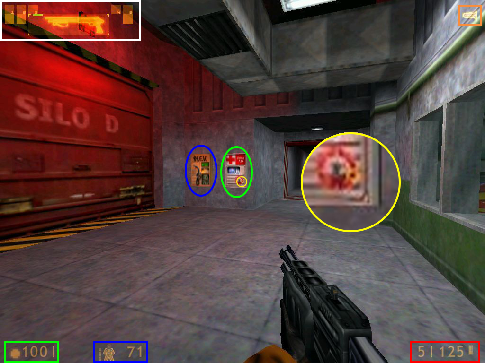
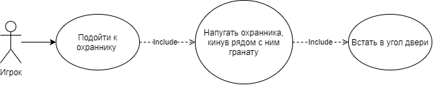
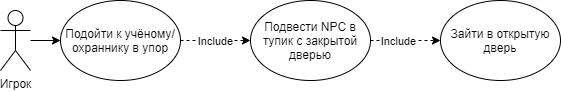
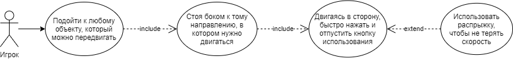
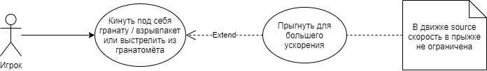
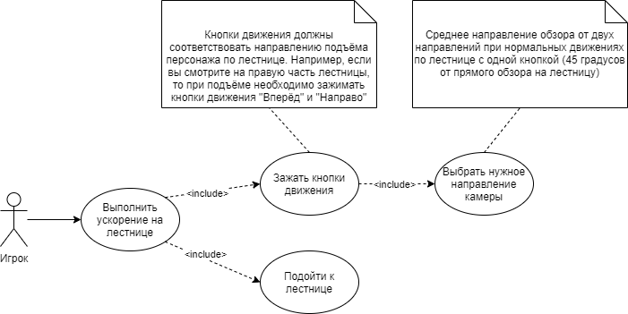

# Resonance-Cascade
Это репозиторий команды <b>\<blank\></b> для выполнения первой практической работы по предмету ТиВПО

Выбранное програмное обеспечение: [**Half-Life**](https://ru.wikipedia.org/wiki/Half-Life)

Состав команды: [Перлов Иван](https://github.com/Torusaynim), [Шахгусейнов Шамхал](https://github.com/shamhal3228), [Бартенев Борис](https://github.com/Flamer322), [Кулагин Иван](https://github.com/Ivan-Kulagin)

## Оглавление

1. [Описание](#Описание)
2. [Игровой процесс](#Игровой-процесс)
3. [Управление](#Управление)
4. [Список багов](#Список-багов)

## Описание

Half-Life — это приключенческий шутер от первого лица разработанный Valve и выпущенный Sierra Entertainment 19 ноября 1998 года, события которого разворачиваются в недрах горы, расположенной в американском штате Нью-Мексико. Именно там по сюжету находится федеральный исследовательский центр гигантских размеров, носящий имя "Черная Меза", и именно там проводится ряд сверхсекретных исследований. Главный персонаж игры — молодой талантливый научный сотрудник Гордон Фримен, работающий в лаборатории аномальных материалов

Обладающий средним уровнем допуска ученый не подозревает о том, какие опасности таит в себе предстоящая работа. Однажды утром Гордона направляют в тестовую камеру для проведения стандартного анализа кристалла. Последствия эксперимента, однако, оказываются катастрофическими. Взрыв кристалла пробивает брешь между измерениями, откуда на Землю начинают наступать инопланетные силы. Гордон, зажатый между инопланетянами и армией США, стремится выбраться из комплекса до того, как его найдут и уничтожат

[:arrow_up:Оглавление](#Оглавление)

## Игровой процесс

Вы должны постоянно обращать внимание на счётчики вашего здоровья и энергии вашего защитного костюма HEV в нижнем левом углу. Зелёным цветом выделен индикатор вашего здоровья, оно имеет предел 100/100. Когда ваше здоровье станет ниже 25, вам следует немедленно найти медицинский пункт, выделенный зелёным эллипсом, или подобрав близлежащую аптечку. Счетчик энергии костюма выделен синим цветом и также имеет предел 100/100. Ваша броня поглощает урон и может серьезно спасти вас в некоторых ситуациях. Когда энергия истощится до 0, ваше здоровье начинает ухудшаться каждый раз, когда вам наносят урон. Зарядить ваш костюм можно воспользовавшись станцией зарядки костюма HEV, выделенной синим эллипсом, или подобрав близлежащую батарею

В правом нижнем углу красным цветом вы увидите счётчик боеприпасов. Он показывает, сколько у вас боеприпасов заряжено в вашем текущем оружии (слева) и сколько всего вы носите с собой (справа). Вам не стоит сильно беспокоиться о боеприпасах в игре, так как их много на всех уровнях. В центре экрана жёлтым цветом выделено перекрестие прицела, которое помогает вам понять куда будет направлена ваша стрельба и различается для каждого оружия. Некоторое оружие, например ракетная установка, оснащено лазерным целеуказателем

Вверху справа оранжевым цветом выделен аккумулятор вашего фонарика. Как только он разрядится до нуля, вы больше не сможете использовать им пользоваться и должны дождаться, пока он снова зарядится. В левом верхнем углу находится меню инвентаря оружия, выделенное белым. Вы можете прокручивать свое оружие с помощью колёсика мыши или использовать цифровые клавиши 1-5 для выбора оружия

[:arrow_up:Оглавление](#Оглавление)

## Управление

В Half-Life используется стандартная раскладка управления, позаимствованная практически целиком с игры Quake. Кроме того, многие современные шутеры имеют схожую раскладку — потому у большинства не должно возникнуть трудностей. При необходимости вы всегда можете изменить их в настройках игры. Также в игре есть тренировочный курс, который научит вас основным аспектам игры и поможет быстрее привыкнуть к управлению

Подробнее о раскладке кнопок...

| Кнопка |	Действие |
|:------:|:---------:|
|  or  | Идти вперёд |
|  or  | Идти назад |
| 	|	Идти влево |
| 	|	Идти вправо |
| 	|	Повернуться налево |
| 	| Повернуться направо |
|  or 	|	Прыжок |
|  | Пригнуться |
|  or  | Взаимодействие |
| 	|	Основной огонь |
|  | Вторичный огонь |
|  or  | Перезарядка |
|  | Перейти на шаг |
| 	|	Фонарик |
| 	|	Нанести спрей (граффити) |
|      | Выбор категории оружия |
| 	|	Выбор внутри категории |
|  | Предыдущее оружие |
|  | Снимок экрана |
|  | Быстрое сохранение |
|  | Быстрая загрузка |
| 	| Пауза |

[:arrow_up:Оглавление](#Оглавление)

## Список багов

### Распрыжка

Данная ошибка является багом игрового движка и была уже в первом Quake

Во всех играх — и двухмерных, и трёхмерных — невозможно управлять силой прыжка, и чтобы можно было точно прыгать и приземляться куда надо, игроку дают некоторую долю управления в воздухе. После каждого прыжка игра сильно тормозит игрока, что препятствует передвижению частыми прыжками. Но если мы отпрыгнем непосредственно в момент приземления, то этого не будет происходить. Такая физика действует только в воздухе из-за того, что на земле включится трение, и скорость быстро упадёт до нормальной — потому для распрыжки требуется чёткое исполнение прыжков или автоматика, делающая прыжок, когда герой будет на земле. Чтобы облегчить эту задачу, нужно сделать чтобы во время приземления отправлялось много команд на прыжок за короткое время. Наиболее простой и часто используемый метод — ролик мыши

Командами в консоли `bind mwheeldown +jump` или `bind mwheelup +jump` мы задаем прыжок на движение ролика мыши вниз или вверх соответственно. При прокрутке ролика возникает множество прыжковых команд и мы отпрыгиваем не теряя скорости. Находясь в воздухе отжимайте вперед и нажимайте клавишу движения вбок и синхронно с ней движение мыши в ту же сторону. Затем то же самое в другую сторону. Если делать все правильно то мы не только не будем медленнее бега, но и можем разогнаться до весьма большой скорости

Изначально разработчики не планировали вносить распрыжку в геймплей — это была программная ошибка, которую нужно было исправить для достижения большей реалистичности игры. Но с открытием распрыжки геймплей стал богаче, появились новые возможности в тактике игры, возросла скорость и зрелищность компьютерных игр. Поэтому некоторые разработчики умышленно решили вносить в свои игры распрыжку в качестве игровой особенности. Так, компания Valve в разработанном ими движке Source реализовала распрыжку, которая наиболее востребована в игре Half-Life 2: Deathmatch

### Edge-баг

Если мы при приземлении с высоты потеряем скорость об край препятствия и полет сразу продолжится, то игра может не успеть среагировать на приземление и не отнимет здоровье

### Бесконечное пополнение здоровья

В конце главы "Поверхностное натяжение" находятся две двери, одна ведёт к выходу из здания с охранником, а другая ведёт к подземной парковке. Обе эти двери должны быть открыты охранником. У этих дверей при разработке карты был выставлен параметр урона при застревании, равный "-1", что при застревании не убавляет, а наоборот прибавляет здоровье игроку и NPC. Вероятней всего это было сделано для того, чтобы охранник не умирал от застревания в двери. Если у игрока есть хоть немного брони, то пополняться будет именно броня

Максимальное количество здоровья равно 2147483647 (Максимально допустимое число в движке). Чтобы достичь такого количества здоровья, вам понадобится стоять в двери ровно 24 дня

Скорость пополнения здоровья равна одной единиц за кадр в секунду, поэтому FPS играет решающую роль в осуществление данного бага

### Активация через стены

Разработчики забыли убрать возможность активации кнопок и других устройств через стены

### Открываем двери учеными и охранниками

Игра автоматически открывает заблокированную дверь перед ученым или охранником, если там нет замка проверяющего глаза. Вся сложность - это заставить их подойти вплотную к двери и сделать движение в эту дверь. Делать это можно толчками в нужные стороны. Фраза, которую говорит ученый, должна быть после открытия ворот в сторону шахты. Но разрабы возможно по ошибке сделали так, чтоб этот ученый умер до того момента

### Ускорение от объекта

Во время зажатой кнопки "использовать" на любом объекте, способном к использованию, игра тормозит игрока и не позволяет набрать ему скорость. Но на короткий момент, когда мы нажимаем "использовать" во время движения, объект получает огромное ускорение и ненадолго связывается с игроком. Если поймать момент, когда скорость объекта уже большая, но связь еще не разорвана и в этот момент отпустить кнопку "использовать", то игрок быстро улетит в ту же сторону что объект

https://user-images.githubusercontent.com/56824837/133257266-32199a03-b484-4b59-9fc1-84b52bed4bc6.mp4

### Ускорение от пушки Гаусса

Во время выстрела 2-й функцией это оружие дает серьезный импульс игроку как отдачу. Его можно использовать как сильный прирост горизонтальной скорости во время нахождения игрока в воздухе

### Ускорение от взрыва

Любой взрыв в непосредственной близости от игрока дает ему мощный импульс. Его можно использовать как увеличение как горизонтальной так и вертикальной скорости

### Мины блокируют ворота

Лазерные мины прилипают к любой плоской текстуре, даже если она принадлежит двигающемуся объекту. Если поставить мину так что она помешает закрыться, то она выйдет из боевого взведения и перейдет в состояние объекта который можно подобрать. Но в данном случае она оказывается внутри ворот и приводит к застреванию ворот, пока не подберешь ее

### Спуск по склону

Спуск без лифта по склону. Игрок способен карабкаться по крутым склонам нажимая кнопку движения ровно перпендикулярно склону. Скорость этого карабканья зависит от крутизны склона и при попадании на склон она в течении секунды-двух приходит к стандартному значению. То есть падая с большой скоростью и попадая на этот склон мы можем нажать кнопку движения в этот склон и мы быстро потеряем скорость, даже если не сможем на него вскарабкаться

### Ускорение по лестнице

Игра рассчитывает скорость и направление движения по лестнице для каждой кнопки движения отдельно. Если мы используем две рядом расположенные кнопки (не противоположные) и возьмем среднее направление обзора от двух направлений при нормальных движениях по лестнице с одной кнопкой, то мы серьезно увеличим скорость этого движения
  

 
https://user-images.githubusercontent.com/71544305/133255854-39d8153b-9c30-4e64-9706-6b3007da5785.mp4

### Зацепился за лестницу

Игрок прикоснувшись к лестнице моментально теряет всю свою скорость без потерь здоровья

[:arrow_up:Оглавление](#Оглавление)
